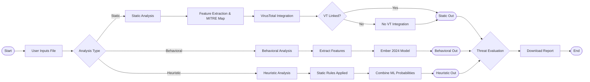

<div align="center">


### MALSECURE: Smart Malware Detection and Classification Using Static, ML-Based Behavioral, and Heuristic Analysis

**Final Year Project — Department of Computer Science & IT, NED University of Engineering & Technology**

Group: CS-22054 | Batch: 2022 | Supervised by Dr. Muhammad Mubashir Khan

<table border="0" cellpadding="10" cellspacing="0">
  <!-- Single Row for All Logos -->
  <tr>
    <td align="center" valign="middle" style="border: none;">
      <a href="#"></a>
    </td>
    <td align="center" valign="middle" style="border: none;">
      <a href="#"></a>
    </td>
    <td align="center" valign="middle" style="border: none;">
      <a href="#"></a>
    </td>
    <td align="center" valign="middle" style="border: none;">
      <a href="#"></a>
    </td>
  </tr>
</table>


</div>

---
## 📺 Promotional Video

> 🔗 **Live Link:** [Watch the MalSecure Video on LinkedIn](https://www.linkedin.com/feed/update/urn:li:activity:7456982564512178176/) 🎬


---

## 🧠 About the Project

Modern malware has grown increasingly sophisticated, leveraging **polymorphic**, **metamorphic**, and **obfuscation-based evasion** techniques that render traditional signature-based antivirus tools inadequate.

**MalSecure** is a hybrid malware analysis toolkit developed as part of an undergraduate final year project at NED University. It addresses this gap by combining three complementary analysis layers into a single, **safe, non-execution** platform:

1. **Static Analysis** — Inspects files without executing them, extracting metadata, strings, imports, file signatures, and structural indicators.
2. **ML-Based Behavioral Analysis** — Uses the pre-trained **EMBER 2024** model to classify files as malicious or benign and predict the malware family.
3. **Heuristic Analysis** — Applies rule-based scoring to detect suspicious patterns like obfuscation, high entropy, packed binaries, and malicious macros.

MalSecure also integrates **VirusTotal** for external threat intelligence and **MITRE ATT&CK** for adversarial technique mapping, giving analysts a comprehensive, explainable view of any suspicious file.

> **Key distinction:** MalSecure never executes the files it analyzes, making it safe for use in academic, research, and forensic environments.

---

## ✨ Key Features

- 🔒 **Safe Non-Execution Analysis** — All scanning is done statically; no file is ever run
- 🧱 **Three-Layer Detection Engine** — Static + ML + Heuristic working in tandem
- 🤖 **EMBER 2024 ML Model** — Pre-trained gradient-boosted model for PE file classification
- 🌐 **VirusTotal Integration** — Hash-based lookup against 70+ antivirus engines
- 🗺️ **MITRE ATT&CK Mapping** — API-to-technique correlation with heatmap visualization
- 📄 **Document Malware Detection** — Scans DOCX, PDF, XLS for macros, embedded exploits, and suspicious scripts
- 📦 **Archive & Packer Detection** — Unpacks and inspects ZIP, RAR; detects UPX and other packers
- 🔍 **IOC Extraction** — Extracts IPs, domains, URLs, and file paths from analyzed samples
- 📊 **YARA Rule Matching** — Detects known malware signatures using community YARA rules
- 📑 **Downloadable Reports** — Structured JSON malware reports for every scan
- 🖥️ **Modern Web UI** — Clean Interactive dashboard with queue-based job management
- ⌨️ **CLI Support** — Full command-line interface for advanced users


---

## 🏗️ System Architecture


MalSecure is built on a **modular, layered architecture**:




---

## 🔬 Analysis Modules

### Layer 1 — Static Analysis

| Module | Description |
|---|---|
| Basic File Analysis | File type, size, headers, strings, imports/exports |
| Hash-Based Scanning | MD5, SHA1, SHA256 generation and known-hash matching |
| Document Analysis | DOCX / PDF / XLS / RTF — macros, scripts, suspicious URLs |
| Archive Analysis | ZIP / RAR — nested extraction and recursive scanning |
| IOC Extraction | IP addresses, domains, URLs, file paths |
| MITRE ATT&CK Mapping | API-to-technique correlation against the ATT&CK database |
| Programming Language Detection | Identifies the language/framework of suspicious executables |
| VirusTotal Lookup | Hash-based reputation query via the VT public API |
| YARA Rule Matching | Signature-based matching using community YARA rulesets |

### Layer 2 — ML-Based Behavioral Analysis

The EMBER 2024 pre-trained LightGBM model analyzes extracted PE features to predict:
- **Malicious vs. Benign** classification
- **Malware family** (Cluster-based labeling from EMBER dataset)
- **AI Risk Score** (0–100) and **Behavior Score**
- **Packer/Obfuscation Score**
- **Final Weighted Risk Score**

Extracted features include: imported API functions, section entropy, header values, string patterns, resource indicators, and structural statistics.

### Layer 3 — Heuristic Analysis

Rule-based engine evaluates:
- Suspicious API imports (keyloggers, process injection, network beacons)
- High-entropy sections (packed/encrypted code)
- Macro auto-execution triggers in documents
- Obfuscated and encoded payloads

Heuristic scores are fused with ML probabilities for a final confidence-weighted risk evaluation.

---

## 🛠️ Technology Stack

| Layer | Technologies |
|---|---|
| Frontend UI | React.js, Tailwind CSS, JavaScript |
| Backend | Python 3.10+, REST APIs |
| Static Analysis | `hashlib`, `regex`, `yara-python`, `lief`, `oletools`, `pefile` |
| Machine Learning | `scikit-learn`, `LightGBM`, `numpy`, `pandas` — EMBER 2024 model |
| Heuristic Engine | Custom rule-based scoring, entropy analysis |
| Queue Management | Python-based task queue |
| Data Storage | JSON-based scan reports |
| External APIs | VirusTotal API  |
| Deployment | Local Python environment  |

---

## 📸 Screenshots

<!-- 📸 INSERT SCREENSHOTS BELOW — replace placeholder text with  tags -->

**Landing Page-Analysis Profile Selection**
<!--  -->


**VirusTotal Integration Results**
<!--  -->


**MITRE ATT&CK Heatmap**
<!--  -->


**Document Malware Analysis Output**
<!--  -->


**Domain / IOC Extraction Output**
<!--  -->


**Archive & Packer Analysis Output**
<!--  -->


**ML Behavioral Analysis Output**
<!--  -->


**YARA Rule Matches**
<!--  -->


---


## 💻 Installation — Windows

### Prerequisites

- Windows 10 / 11
- Python 3.10–3.12 ([download here](https://www.python.org/downloads/))
- Git ([download here](https://git-scm.com/))

### Step 1 — Clone the Repository

Open **Command Prompt** or **PowerShell** as Administrator:

```bash
git clone https://github.com/YOUR_USERNAME/MalSecure.git
cd MalSecure
```

> Replace `YOUR_USERNAME/MalSecure` with your actual GitHub repository URL.

### Step 2 — Create and Activate Virtual Environment

```cmd
python -m venv Malsec_venv
Malsec_venv\Scripts\activate
```

> **If you get a scripts execution policy error**, run this once as Administrator in PowerShell:
> ```powershell
> Set-ExecutionPolicy -ExecutionPolicy RemoteSigned -Scope CurrentUser
> ```
> Then re-run the activate command.

### Step 3 — Install Dependencies

```cmd
pip install --upgrade pip setuptools wheel
pip install -r requirements.txt
```

### Step 4 — Configure VirusTotal API Key

```cmd
python Malsecure.py --key_init
```

You will be prompted to enter your VirusTotal API key. Get a free key at [virustotal.com](https://www.virustotal.com).

### Step 5 — Launch the Application

**GUI Mode (Streamlit):**
```cmd
python Malsecure.py --ui
```
Then open your browser at `http://localhost:5055`


### Step 6 — Deactivate Environment (when done)

```cmd
deactivate
```

---

## 🐧 Installation — Linux / Kali Linux

### Prerequisites

- Ubuntu 20.04+ / Kali Linux (recommended)
- Python 3.10–3.13
- Git, build tools, YARA

### Step 1 — Clone the Repository

```bash
git clone https://github.com/YOUR_USERNAME/MalSecure.git
cd MalSecure
```

### Step 2 — Install System Dependencies

```bash
sudo apt update
sudo apt install -y \
  build-essential \
  python3-dev \
  libssl-dev \
  libffi-dev \
  yara \
  libyara-dev \
  git
```

### Step 3 — Create and Activate Virtual Environment

```bash
python3 -m venv malsec_venv
source malsec_venv/bin/activate
pip install --upgrade pip setuptools wheel
```

### Step 4 — Install Python Dependencies

```bash
pip install yara-python lief streamlit pandas scikit-learn
pip install -r requirements.txt
```

> **Note:** If you encounter build errors on Python 3.13, ensure `python3-dev` is installed and matches your Python version. The project has been tested on Python 3.10–3.13.

### Step 5 — Configure VirusTotal API Key

```bash
python3 Malsecure.py --key_init
```

Enter your VirusTotal API key when prompted.

### Step 6 — Launch the Application

**GUI Mode (Streamlit):**
```bash
python3 Malsecure.py --ui
```
Then open your browser at `http://localhost:5055`


### Step 7 — Deactivate Environment (when done)

```bash
deactivate
```

---

From the dashboard you can:

1. **Upload** a suspicious file (EXE, DLL, PDF, DOCX, ZIP, RAR, and more)
2. **Select** an analysis profile (Standard, Document, Archive, Packer Detect, ML Behavioral, IOC, Language)
3. **Queue** the analysis job
4. **View** real-time results and download the JSON report

### Available Analysis Profiles

| Profile | What It Does |
|---|---|
| **Standard Analysis** | Full static triage — MITRE mapping, VT lookup, YARA, IOC extraction |
| **Document** | Macro and ioc detection in DOCX/PDF/XLS |
| **Archive** | Nested IOC/YARA scan of ZIP/RAR files |
| **Packer Detect** | Entropy-based packer and obfuscator detection |
| **Domain / IOC** | URL, IP, domain, and file-path extraction |
| **Language** | Programming language fingerprinting |
| **ML Behavioral Scan** | EMBER 2024 model — risk score, malware family, confidence |

---


## 🔑 VirusTotal API Key Setup

MalSecure uses the **VirusTotal Public API v3** for hash-based malware reputation lookups.

**Step 1:** Create a free account at [https://www.virustotal.com](https://www.virustotal.com)

**Step 2:** Navigate to your profile → **API Key**

**Step 3:** Copy your API key and run:

```bash
# Windows
python Malsecure.py --key_init

# Linux
python3 Malsecure.py --key_init
```

Enter your key when prompted. It will be saved locally in the project's environment configuration.

> **Without an API key**, VirusTotal lookups will be skipped — all other analysis layers remain fully functional.

---

## ⌨️ CLI Usage

MalSecure supports a full CLI mode for advanced users and scripted pipelines.

```bash
# Basic file analysis
python3 Malsecure.py --file suspicious.exe --analyze

# Hash scan
python3 Malsecure.py --file suspicious.exe --hashscan

# Document analysis
python3 Malsecure.py --file malicious.docx --docs

# Archive analysis  
python Malsecure.py --file suspicious_archive_file --archive

# Set VirusTotal key
python3 Malsecure.py --key_init
```

---

## 🔧 Troubleshooting

### Windows

| Issue | Solution |
|---|---|
| `Scripts is disabled on this system` | Run `Set-ExecutionPolicy -ExecutionPolicy RemoteSigned -Scope CurrentUser` in PowerShell as Admin |
| `ModuleNotFoundError` | Ensure your venv is activated: `Malsec_venv\Scripts\activate` |

### Linux

| Issue | Solution |
|---|---|
| `python3.11-dev: Unable to locate package` | Use `python3-dev` instead — it matches your installed Python version |
| `yara-python` build failure | Install system YARA first: `sudo apt install yara libyara-dev` |
| `BrokenPipeError` on first GUI launch | This is a known Streamlit pipe issue on first run — simply re-run `streamlit run gui.py` |
| VirusTotal results not showing | Run `python3 Malsecure.py --key_init` and enter a valid API key |
| Permission denied on Linux | Run with `sudo` or ensure you own the project directory |


---

## 👥 Project Team

| Name | Roll No. | Email | Contribution |
|---|---|---|---|
| **Syeda Mehak Ali** | CR-22001 | ali4502643@cloud.neduet.edu.pk | Static analysis, base code structure, GUI layout, heuristic analysis |
| **Hafsa Usman** | CR-22003 | usman4500959@cloud.neduet.edu.pk | Behavioral analysis (EMBER integration), report writing (Ch. 1, 2), testing |
| **Syeda Abiha Shams** | CR-22018 | shams4520533@cloud.neduet.edu.pk | Behavioral analysis (EMBER integration), system architecture, diagrams, testing |
| **Ayesha Majid Chugtai** | CR-22026 | chughtai4501705@cloud.neduet.edu.pk | VirusTotal & MITRE ATT&CK integration, executive summary, heuristic analysis |

**Supervisor:** Dr. Muhammad Mubashir Khan — Professor & Chairman, CSIT Department, NED University

**Co-Supervisor:** Miss Sadia Arshad

---

## 🙏 Acknowledgements

We extend our gratitude to:

- **Dr. Muhammad Mubashir Khan** for his guidance, constructive feedback, and continuous mentorship throughout this project.
- **Miss Sadia Arshad** for her support, attention to detail, and invaluable advice in refining the MalSecure toolkit.
- **NED University of Engineering & Technology**, Department of Computer Science & Information Technology.

---

## 📄 License

This project is submitted in partial fulfillment of the requirements for the **Bachelor of Engineering in Computer Science**, NED University of Engineering & Technology, Karachi, June 2026.

© NED University of Engineering & Technology. All Rights Reserved.

---

<div align="center">

By Team CS-22054 · NED University · 2026


<!--  -->

</div>
